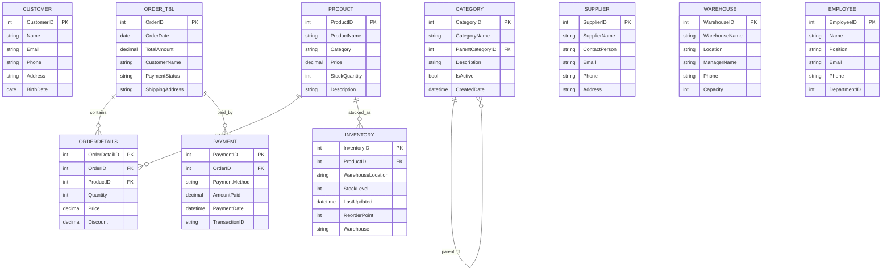
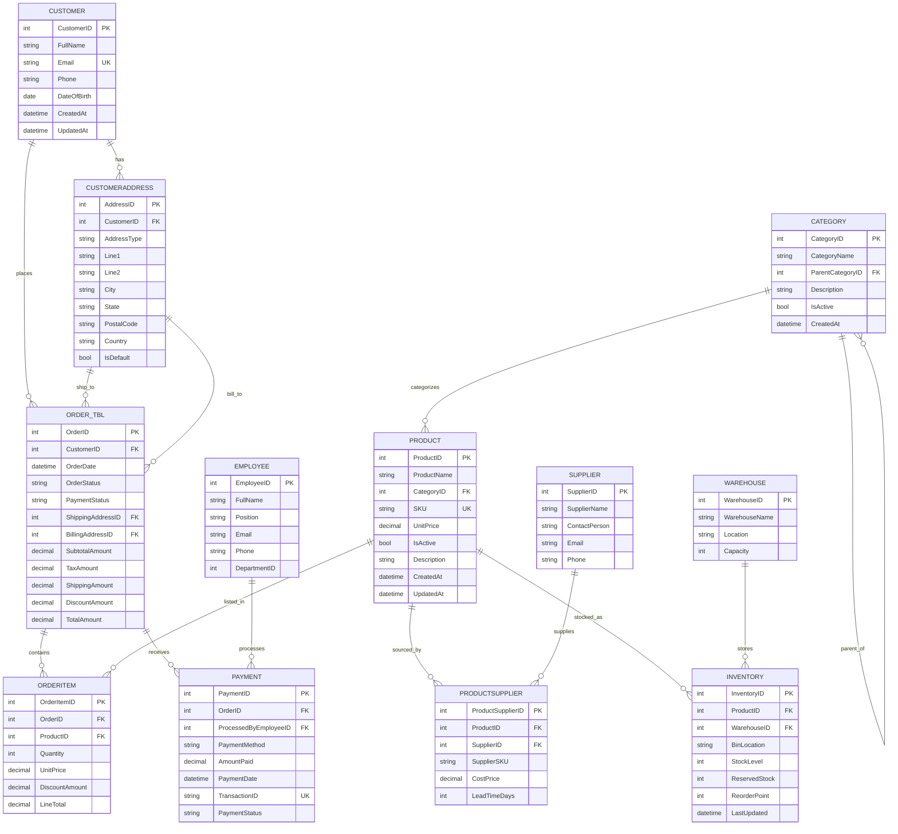

# ERD Visuals

These are quick visuals you can view directly in Markdown (Mermaid).

## Current ERD (as provided)

```mermaid
erDiagram
    CUSTOMER {
        int CustomerID PK
        string Name
        string Email
        string Phone
        string Address
        date BirthDate
    }
    ORDER_TBL {
        int OrderID PK
        date OrderDate
        decimal TotalAmount
        string CustomerName
        string PaymentStatus
        string ShippingAddress
    }
    PRODUCT {
        int ProductID PK
        string ProductName
        string Category
        decimal Price
        int StockQuantity
        string Description
    }
    CATEGORY {
        int CategoryID PK
        string CategoryName
        int ParentCategoryID FK
        string Description
        bool IsActive
        datetime CreatedDate
    }
    ORDERDETAILS {
        int OrderDetailID PK
        int OrderID FK
        int ProductID FK
        int Quantity
        decimal Price
        decimal Discount
    }
    SUPPLIER {
        int SupplierID PK
        string SupplierName
        string ContactPerson
        string Email
        string Phone
        string Address
    }
    INVENTORY {
        int InventoryID PK
        int ProductID FK
        string WarehouseLocation
        int StockLevel
        datetime LastUpdated
        int ReorderPoint
        string Warehouse
    }
    WAREHOUSE {
        int WarehouseID PK
        string WarehouseName
        string Location
        string ManagerName
        string Phone
        int Capacity
    }
    PAYMENT {
        int PaymentID PK
        int OrderID FK
        string PaymentMethod
        decimal AmountPaid
        datetime PaymentDate
        string TransactionID
    }
    EMPLOYEE {
        int EmployeeID PK
        string Name
        string Position
        string Email
        string Phone
        int DepartmentID
    }

    ORDER_TBL ||--o{ ORDERDETAILS : contains
    PRODUCT ||--o{ ORDERDETAILS : listed_in
    PRODUCT ||--o{ INVENTORY : stocked_as
    ORDER_TBL ||--o{ PAYMENT : paid_by
    CATEGORY ||--o{ CATEGORY : parent_of
```

## Improved ERD (normalized)

```mermaid
erDiagram
    CUSTOMER {
        int CustomerID PK
        string FullName
        string Email UK
        string Phone
        date DateOfBirth
        datetime CreatedAt
        datetime UpdatedAt
    }
    CUSTOMERADDRESS {
        int AddressID PK
        int CustomerID FK
        string AddressType
        string Line1
        string Line2
        string City
        string State
        string PostalCode
        string Country
        bool IsDefault
    }
    ORDER_TBL {
        int OrderID PK
        int CustomerID FK
        datetime OrderDate
        string OrderStatus
        string PaymentStatus
        int ShippingAddressID FK
        int BillingAddressID FK
        decimal SubtotalAmount
        decimal TaxAmount
        decimal ShippingAmount
        decimal DiscountAmount
        decimal TotalAmount
    }
    ORDERITEM {
        int OrderItemID PK
        int OrderID FK
        int ProductID FK
        int Quantity
        decimal UnitPrice
        decimal DiscountAmount
        decimal LineTotal
    }
    CATEGORY {
        int CategoryID PK
        string CategoryName
        int ParentCategoryID FK
        string Description
        bool IsActive
        datetime CreatedAt
    }
    PRODUCT {
        int ProductID PK
        string ProductName
        int CategoryID FK
        string SKU UK
        decimal UnitPrice
        bool IsActive
        string Description
        datetime CreatedAt
        datetime UpdatedAt
    }
    SUPPLIER {
        int SupplierID PK
        string SupplierName
        string ContactPerson
        string Email
        string Phone
    }
    PRODUCTSUPPLIER {
        int ProductSupplierID PK
        int ProductID FK
        int SupplierID FK
        string SupplierSKU
        decimal CostPrice
        int LeadTimeDays
    }
    WAREHOUSE {
        int WarehouseID PK
        string WarehouseName
        string Location
        int Capacity
    }
    INVENTORY {
        int InventoryID PK
        int ProductID FK
        int WarehouseID FK
        string BinLocation
        int StockLevel
        int ReservedStock
        int ReorderPoint
        datetime LastUpdated
    }
    PAYMENT {
        int PaymentID PK
        int OrderID FK
        int ProcessedByEmployeeID FK
        string PaymentMethod
        decimal AmountPaid
        datetime PaymentDate
        string TransactionID UK
        string PaymentStatus
    }
    EMPLOYEE {
        int EmployeeID PK
        string FullName
        string Position
        string Email
        string Phone
        int DepartmentID
    }

    CUSTOMER ||--o{ CUSTOMERADDRESS : has
    CUSTOMER ||--o{ ORDER_TBL : places
    CUSTOMERADDRESS ||--o{ ORDER_TBL : ship_to
    CUSTOMERADDRESS ||--o{ ORDER_TBL : bill_to
    ORDER_TBL ||--o{ ORDERITEM : contains
    PRODUCT ||--o{ ORDERITEM : listed_in
    CATEGORY ||--o{ PRODUCT : categorizes
    CATEGORY ||--o{ CATEGORY : parent_of
    PRODUCT ||--o{ PRODUCTSUPPLIER : sourced_by
    SUPPLIER ||--o{ PRODUCTSUPPLIER : supplies
    PRODUCT ||--o{ INVENTORY : stocked_as
    WAREHOUSE ||--o{ INVENTORY : stores
    ORDER_TBL ||--o{ PAYMENT : receives
    EMPLOYEE ||--o{ PAYMENT : processes
```
